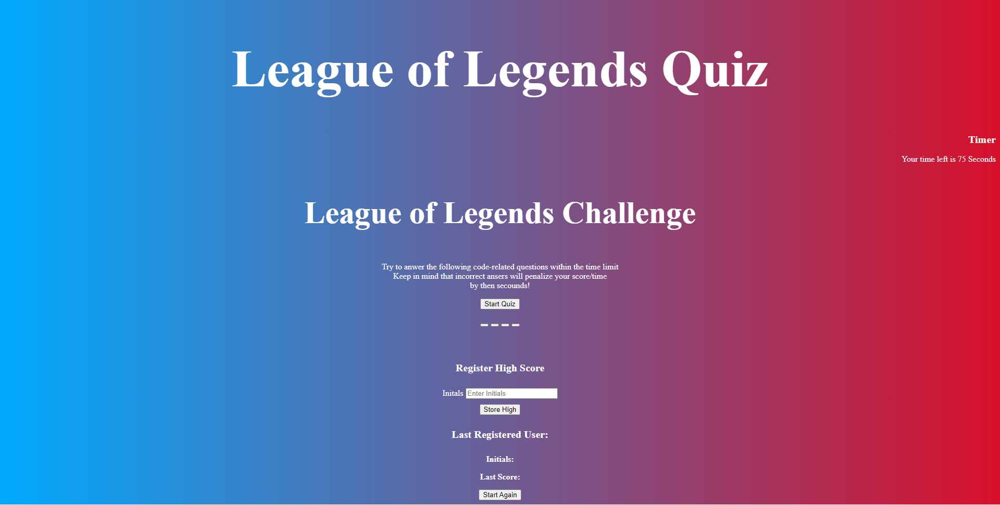

# lol-quiz

## Description

Provide a short description explaining the what, why, and how of your project. Use the following questions as a guide:

- What was your motivation? 
My motiavtion for this project was to able to understand the concepts of Application Programming Interface. 

- Why did you build this project? 
I builded this project becuase I wanted to know how the API interacts with the HTML file. It's intresting what does API can do a web page. It created a complicated concept. 

- What problem does it solve?
The program solves multiple problems. From first creating the function of start buttom to saving score and initials. It was a challenging project for me. I know that the code does not look clean but I think it does the job.  

- What did you learn?
I learned the concepts of Application Programming Interface. The concepts that found more intresting was to the storege of items. I can found knowing that concept helpful in the future. In addition, also found the time concept really intresting. Overall I still need to master the concepts but I have a good understanding of how API work. 

## Table of Contents (Optional)

- [Accepted Criteria](#criteria)
- [Usage](#usage)
- [Credits](#credits)
- [License](#license)

## Accepted Criteria

GIVEN I am taking a code quiz

WHEN I click the start button

THEN a timer starts and I am presented with a question

WHEN I answer a question

THEN I am presented with another question

WHEN I answer a question incorrectly

THEN time is subtracted from the clock

WHEN all questions are answered or the timer reaches 0

THEN the game is over

WHEN the game is over

THEN I can save my initials and score

## Usage

  [Website link]()

  `assets/images`
   md 

## Credits

If you used any third-party assets that require attribution, list the creators with links to their primary web presence in this section.

[Javascript]()
[StackOverFlow]()
[Concat]()
[Line 64]()
[Const]()
[String Length]()
[IsNan]()

## License

MIT License

Copyright (c) 2022 Huertz

Permission is hereby granted, free of charge, to any person obtaining a copy
of this software and associated documentation files (the "Software"), to deal
in the Software without restriction, including without limitation the rights
to use, copy, modify, merge, publish, distribute, sublicense, and/or sell
copies of the Software, and to permit persons to whom the Software is
furnished to do so, subject to the following conditions:

The above copyright notice and this permission notice shall be included in all
copies or substantial portions of the Software.

THE SOFTWARE IS PROVIDED "AS IS", WITHOUT WARRANTY OF ANY KIND, EXPRESS OR
IMPLIED, INCLUDING BUT NOT LIMITED TO THE WARRANTIES OF MERCHANTABILITY,
FITNESS FOR A PARTICULAR PURPOSE AND NONINFRINGEMENT. IN NO EVENT SHALL THE
AUTHORS OR COPYRIGHT HOLDERS BE LIABLE FOR ANY CLAIM, DAMAGES OR OTHER
LIABILITY, WHETHER IN AN ACTION OF CONTRACT, TORT OR OTHERWISE, ARISING FROM,
OUT OF OR IN CONNECTION WITH THE SOFTWARE OR THE USE OR OTHER DEALINGS IN THE
SOFTWARE.

---

🏆 The previous sections are the bare minimum, and your project will ultimately determine the content of this document. You might also want to consider adding the following sections.

## Badges

Badges aren't necessary, per se, but they demonstrate street cred. Badges let other developers know that you know what you're doing. Check out the badges hosted by [shields.io](https://shields.io/). You may not understand what they all represent now, but you will in time.

## Features

If your project has a lot of features, list them here.

## How to Contribute

If you created an application or package and would like other developers to contribute it, you can include guidelines for how to do so. The [Contributor Covenant](https://www.contributor-covenant.org/) is an industry standard, but you can always write your own if you'd prefer.

## Tests